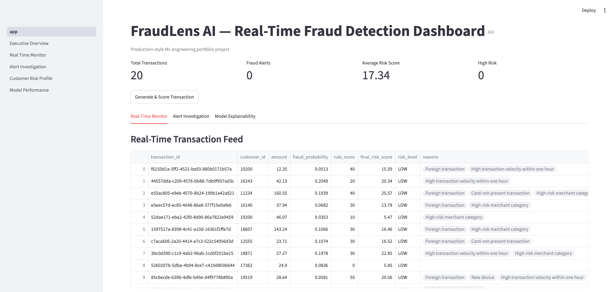
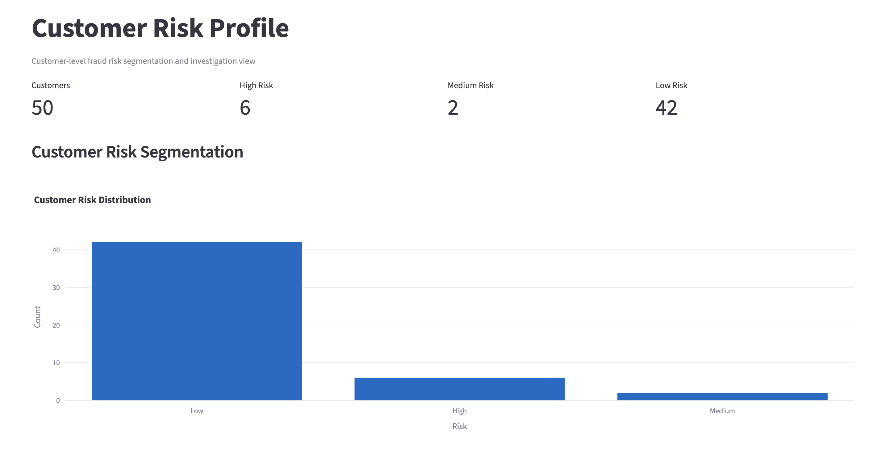
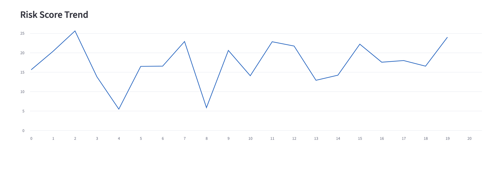
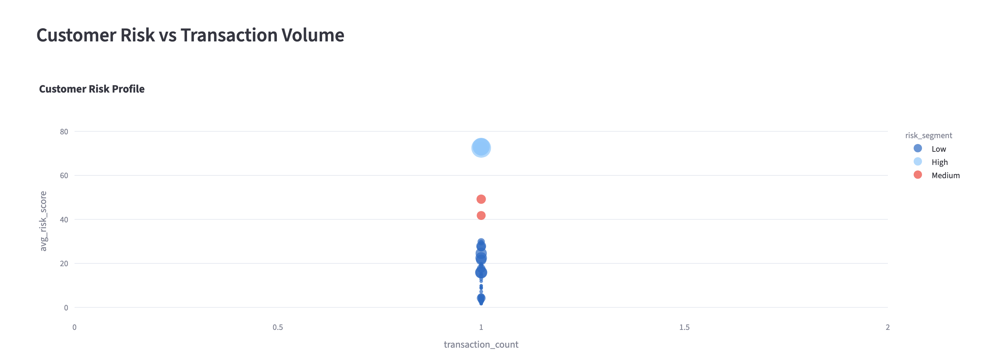
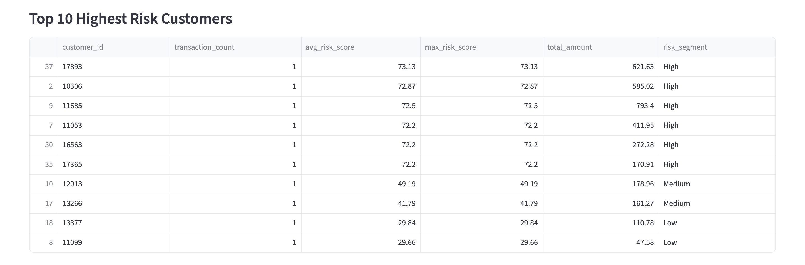
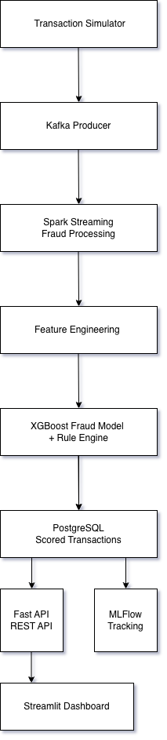

# FraudLens AI


Real-time fraud detection and investigation platform that combines machine learning predictions with rule-based risk signals to identify suspicious transactions and support fraud analyst workflows.

Built with Python, XGBoost, FastAPI, Streamlit, Kafka, Spark Structured Streaming, PostgreSQL, Docker, and MLflow.

---

## Business Problem

Financial institutions process millions of transactions every day. Traditional rule-based fraud systems often generate excessive false positives, while machine learning models can be difficult for investigators to interpret.

FraudLens AI demonstrates a hybrid approach that combines machine learning predictions, behavioral risk features, and fraud detection rules to:

* Detect suspicious transactions
* Prioritize high-risk alerts
* Support analyst investigation workflows
* Provide explainable fraud decisions

---

## Dashboard Demo

### Executive Overview



### Customer Risk Profile



### Risk Trend Monitoring



### Alert Investigation



### Highest Risk Customers



The Streamlit dashboard supports transaction monitoring, customer risk segmentation, alert investigation, and fraud analyst workflows.

---
## Sample Results

Generated Customer Segmentation:

- High Risk: 6
- Medium Risk: 2
- Low Risk: 42

Highest Observed Risk Score:
73.13

Example Risk Indicators:

- Foreign Transaction
- New Device
- High Velocity Activity
- High-Risk Merchant
---

## System Architecture



### End-to-End Workflow

1. Generate or ingest transactions.
2. Publish transaction events through Kafka.
3. Process transactions using Spark Structured Streaming.
4. Apply feature engineering and behavioral risk enrichment.
5. Score transactions using machine learning and fraud rules.
6. Store transactions, predictions, and alerts in PostgreSQL.
7. Surface results through FastAPI services and Streamlit dashboards.

---

## Fraud Scoring Framework

FraudLens uses a hybrid scoring approach:

```text
Final Risk Score =
70% Machine Learning Probability
+
30% Rule-Based Fraud Signals
```

Rule signals include:

* Transaction amount deviation from customer baseline
* Foreign transactions
* New device usage
* Card-not-present activity
* High-risk merchant categories
* High transaction velocity

---

## Technology Stack

| Layer            | Technologies                                   |
| ---------------- | ---------------------------------------------- |
| Language         | Python                                         |
| Machine Learning | Scikit-Learn, XGBoost, SHAP, MLflow            |
| Streaming        | Kafka, Spark Structured Streaming              |
| Storage          | PostgreSQL, Redis                              |
| API              | FastAPI, Pydantic                              |
| Dashboard        | Streamlit, Plotly                              |
| DevOps           | Docker, Docker Compose, Pytest, GitHub Actions |

---

## Project Structure

```text
src/
├── api/          FastAPI services
├── dashboard/    Streamlit dashboards
├── data/         Validation and persistence
├── features/     Feature engineering
├── models/       Training, inference, explainability
├── rules/        Fraud rule engine
├── simulator/    Transaction generation
└── streaming/    Kafka and Spark streaming
```

---

## Machine Learning Approach

Included models:

* Logistic Regression baseline
* Random Forest baseline
* XGBoost production candidate

Evaluation metrics:

* Precision
* Recall
* F1 Score
* ROC-AUC
* PR-AUC

The platform supports both real transaction datasets and synthetic transaction generation for local experimentation.

Recommended dataset:

```text
data/raw/creditcard.csv
```

---

## Alert Investigation Workflow

```text
OPEN
  ↓
UNDER_REVIEW
  ↓
CONFIRMED_FRAUD / FALSE_POSITIVE
  ↓
CLOSED
```

Status history is persisted for auditability and analyst review.

---

## API Example

Score a transaction:

```bash
curl -X POST "http://localhost:8000/score-transaction?persist=true"
```

View alerts:

```bash
curl http://localhost:8000/alerts
```

Update alert status:

```bash
curl -X PATCH http://localhost:8000/alerts/{id}/status
```

---

## Local Setup

```bash
python -m venv .venv
source .venv/bin/activate
pip install -r requirements.txt

make seed-model
make api
```

API documentation:

```text
http://localhost:8000/docs
```

Run dashboard:

```bash
make dashboard
```

---

## Docker Deployment

```bash
docker compose up --build
```

Available services:

```text
API:       http://localhost:8000/docs
Dashboard: http://localhost:8501
MLflow:    http://localhost:5000
```

---

## Testing

Run the test suite:

```bash
pytest -q
```

Current test coverage includes:

* API endpoints
* Feature engineering
* Data validation
* Fraud rules
* Model prediction
* Streaming pipeline validation

---

## Key Engineering Highlights

* Built an end-to-end fraud detection platform spanning ingestion, scoring, persistence, investigation, and monitoring.
* Combined machine learning predictions with business-rule scoring for explainable fraud decisions.
* Implemented transaction simulation, alert lifecycle management, and customer risk profiling.
* Added automated testing, Dockerized deployment, and CI workflows for reproducible development.

---

## Project Highlights

**FraudLens AI — Real-Time Fraud Detection Platform | Python, Kafka, Spark, XGBoost, FastAPI, PostgreSQL, Streamlit, Docker**

* Built an end-to-end fraud detection platform with transaction simulation, hybrid fraud scoring, alert management, and analyst dashboards.
* Designed a machine learning and rule-based scoring framework to identify suspicious transactions and prioritize high-risk alerts.
* Developed FastAPI services, Streamlit dashboards, automated testing, and Dockerized deployment workflows.
* Implemented customer risk profiling, fraud investigation workflows, and explainable fraud scoring.

---

## Scope

This repository is a portfolio-grade fraud analytics platform intended for learning, experimentation, and demonstration purposes.

A production banking deployment would additionally require:

* Identity and access management
* PII governance
* Audit logging
* Model monitoring and drift detection
* Compliance and regulatory controls
* Security hardening
* High-availability infrastructure
